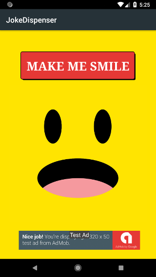
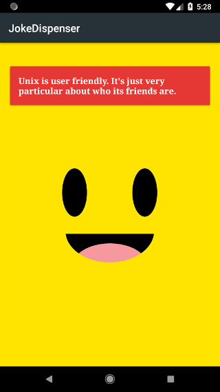

# JokeDispenser
A very simple app that displays random jokes. The purpose is to showcase basic communication between a JAVA library, a cloud server and an Android library.

*Third project for [Udacity's Android Developer Nanodegree Program](https://eu.udacity.com/course/android-developer-nanodegree-by-google--nd801) (built in partnership with Google).*

## Built with
- JAVA library to generate jokes.
- `Google Cloud Engine (GCE)` to retrieve a joke from the JAVA library.
- Android library to display the fetched joke.
- `Google Mobile Ads` to display a banner and an interstitial ad in the free flavour of the app.
- `Espresso`, `IdlingResource` and a custom gradle task to start the GCE server, and run a test that determines if a joke was successfully retrieved.

## Prerequisites
[Install](https://cloud.google.com/sdk/docs/) and [configure](https://cloud.google.com/endpoints/docs/frameworks/java/migrating-android#cloudsdk) Cloud SDK. Before launching the app, start a local GCE instance by running `appengineStart` gradle task.

## Screen captures

## Credits
[Udacity](https://github.com/udacity/ud867/tree/master/FinalProject) - starting code containing GCE module.

## Licence
This project is licensed under the MIT Licence - see the [LICENSE](LICENSE) file for details.